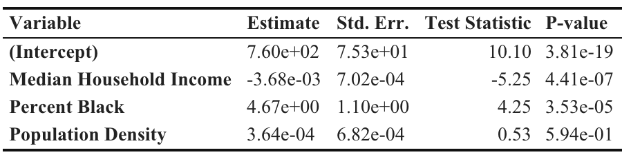

 

## **Motor Vehicle Collision Crash Frequency and Demographic Characteristics in New York City, 2020**

 

### Background

As reported, road traffic mortality is the fifth leading cause of death in the world. According to the Global Status Report on Road Safety 2018, the number of annual road traffic deaths has reached 1.35 million. This burden falls disproportionately on low- and middle-income countries. However, traffic mortality is a great problem for the United States as well, where, in 2015, a 7.2% increase in traffic deaths was observed from the previous year. In 2020, over 100,000 motor vehicle collision crashes were recorded in New York City. Within developed countries such as the U.S., people with lower socioeconomic status are more likely to be involved in these “accidents”. This project aims to explore the spatial clustering in crashes, and to examine the relationship between demographic characteristics and crash frequency at a zip code level in NYC, 2020.

 

### Methods

Motor vehicle collision data was obtained from [NYC OpenData](https://data.cityofnewyork.us/Public-Safety/Motor-Vehicle-Collisions-Crashes/h9gi-nx95/), originally provided by New York Police Department (NYPD).
Demographic data (median household income, Black or African American alone and total population) was obtained from the American Community Survey, [U.S. Census Bureau](https://data.census.gov/).

Expected motor vehicle collision values were calculated based on traffic volume by zip code. Risk was calculated as observed divided by expected crash counts. Traffic volume data was obtained from [National Neighborhood Data Archive (NaNDA)](https://www.openicpsr.org/openicpsr/project/160261/version/V1/view/). The most recent records for zip codes in NYC were from the year of 2016.

Data preprocessing and regression analyses were achieved by RStudio. Maps were generated by QGIS and RStudio. Cluster analysis including Moran’s I and p-value were completed by GeoDa.

 

### Results and Discussions

  

 
Risk of motor vehicle collision crash ranged from 0.02 to 3.59 across 162 zip codes with valid traffic volume value records in New York City.

  

 
Regarding the spatial variation in crash frequency, significant clustering of hot spots were identified in central Bronx and east Brooklyn, and significant clustering of cold spots were identified in Lower Manhattan and east Queens (Moran’s I = 0.43, p = 0.001).

  
  <figcaption>Ordinary Least Squares Global Regression Results</figcaption>

 
Approximately 30.5% of variation in crash frequency could be explained by poverty level, percent Black, and population density. The OLS regression results indicated that median household income was negatively related to crash frequency, and percent Black was positively related. On average, a 1,000-dollar increase in median household income led to a 3.68 unit decrease in crash frequency (t = -5.25, p < 0.001), while a one-percent increase in percent Black led to a 4.67 unit increase in crash frequency (t = 4.25, p < 0.001).

  

 
Relationship between demographic characteristics and crash frequency varied spatially. The local R-squared of GWR results indicated that the fitted model could explain as little as 34.3% or as much as 79.5% of variation in crash frequency.

Limitations included incomplete data of traffic volume values for some zip codes, leading to the missing of corresponding relative risk of motor vehicle collision crash (as colored in gray in Map 1). Traffic volume data was from 2016, while all the other data was collected in 2020 – the expected crash counts estimated based on traffic volume in 2016 might not perfectly represent the situations in 2020.

 

### Conclusions

There were significant spatial clusters regarding spatial variation in crash frequency in New York City, 2020, and these clusters were strongly and significantly related to some demographic predictors, including poverty level and percent Black. This project can guide interventions for both public health and urban planning professionals that aim to reduce the burden on individuals from lower socioeconomic class.

As next steps, more results from GWR model, such as the spatial variance in coefficient for each predictor, could be mapped out, and some other possibly relevant determinants of crash frequency could be investigated for a more exhaustive study of the relationship thereof.

 

### References

1. Chimba, D., Musinguzi, A., & Kidando, E. (2018). Associating pedestrian crashes with demographic and socioeconomic factors. *Case Studies on Transport Policy, 6*(1), 11-16. https://doi.org/https://doi.org/10.1016/j.cstp.2018.01.006
2. Cottrill, C. D., & Thakuriah, P. (2010). Evaluating pedestrian crashes in areas with high low-income or minority populations. *Accident Analysis & Prevention, 42*(6), 1718-1728. https://doi.org/https://doi.org/10.1016/j.aap.2010.04.012
3. Dai, D. (2012). Identifying clusters and risk factors of injuries in pedestrian–vehicle crashes in a GIS environment. *Journal of Transport Geography, 24*, 206-214. https://doi.org/https://doi.org/10.1016/j.jtrangeo.2012.02.005
4. Gostin, L. (2018). Traffic injuries and deaths: A public health problem we can solve. *JAMA Forum Archive, A7*(1). https://doi.org/10.1001/jamahealthforum.2018.0009
5. Morency, P., Gauvin, L., Plante, C., Fournier, M., & Morency, C. (2012). Neighborhood social inequalities in road traffic injuries: the influence of traffic volume and road design. *Am J Public Health, 102*(6), 1112-1119. https://doi.org/10.2105/ajph.2011.300528 
6. World Health Organization. (2018, June 17). *Global status report on road safety 2018*. World Health Organization. Retrieved November 13, 2022, from https://www.who.int/publications/i/item/9789241565684   

 

### Final Deliverable

[Download the Poster](./resources/Gao_Siyue_Poster_for_Public_Health_GIS.pdf)
