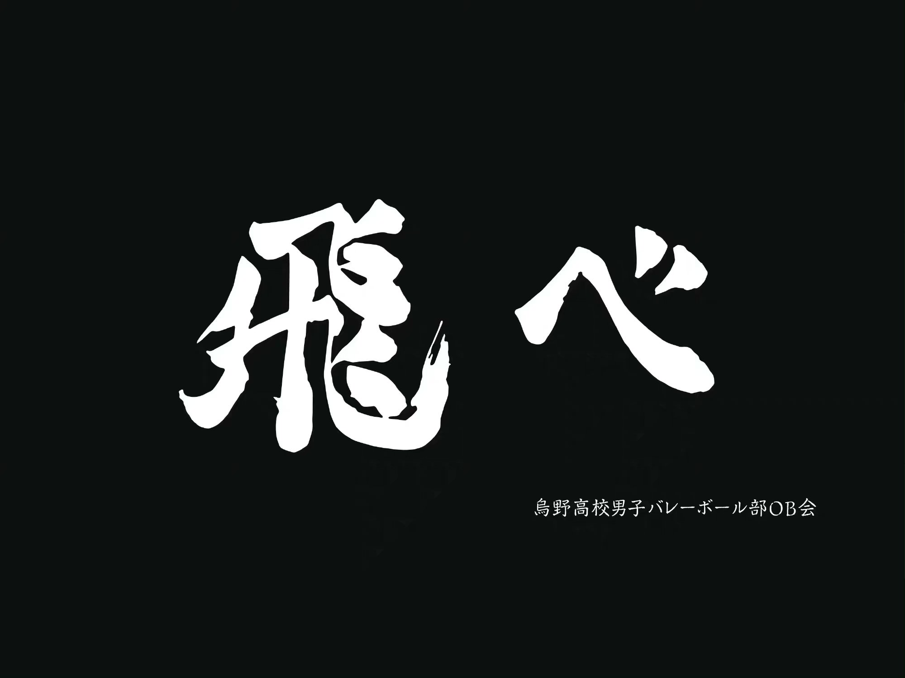

 

I'm originally from Beijing, China and currently live in New York City, United States for my Master's Degree study.

I'm a big fan of the Zelda Series, especially the Legend of Zelda: Breath of the Wild. A fun fact is that I've reached 1,000+ hours in it with multiple accounts in both Normal and Master Mode.

I also spend my spare time with my favorite residents on the Island, in [Animal Crossing](https://www.youtube.com/watch?v=_3YNL0OWio0). Here are some screenshots showing the cozy time we spent together.

  
  <figcaption>Early in the morning: Kid Cat enjoying the fresh air next to his house</figcaption>
  
  
  <figcaption>Late at night: Tutu and I sitting in front of the Able Sisters, the clothing shop on the Island</figcaption>
  
  
  <figcaption>All residents celebrating the completion of a new bridge, with Tom Nook and Isabelle</figcaption>

 

I have a great collection of manga and goods from [Haikyu!!](https://haikyu.jp/), the best Sports anime (from my perspective) in the world. Shoyo Hinata, the main character illustrated by the author, Haruichi Furudate, is out to prove that in volleyball (and possibly everything you're chasing for), you don't need to be tall to fly!

  

